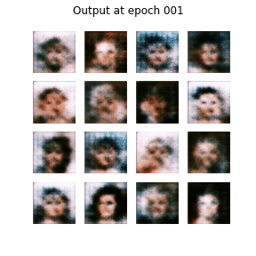

# DCGAN_Face_Generation
Generate faces using DCGAN by using Celeb-Face data set available on Kaggle.

The model was trained for 80 epochs. 
#### Here's the models output on the same noise as the epoch progresses. 

